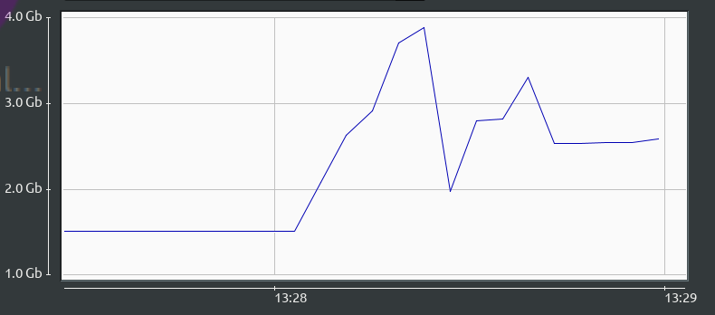

# Teaching-HEIGVD-AMT-2019-Project-One

### Part 4. Experiment

We were asked to test how the application was reacting on load. To do that we used JMeter.

We have done two series of test:

- The first is with paging, that mean we will display only 25 users per page. There are loaded from the DAO with an offset and limitation system. The offset will be our page number and the limit (set to 25) is hard coded in the SQL queries.
- The second is without paging, that mean that when we go in the "characters" menu we will load all the characters of the database.

The goal is to show how well pagination works on server performance and user experience. 

Note: to change the behaviors of the project (paging or not) we need to uncomment the line 

#### With paging

This is the command that we used to launch the test.

```bash
JVM_ARGS='-Xms4096m -Xmx4096m' ./jmeter -n -t ../../Teaching-HEIGVD-AMT-2019-Project-One/jMeter/100Th_1It.jmx  -l ../../Teaching-HEIGVD-AMT-2019-Project-One/reportJmeter/100th_1it_pagined -e -o ../../Teaching-HEIGVD-AMT-2019-Project-One/reportJmeter/100th_1it_pagined_dir
```


With paging we have no problems. We can see on the table just below that we have an average time of 1032.32 ms to display the page.


#### Without paging

This is the command that we used to launch the test.

```bash
JVM_ARGS='-Xms4096m -Xmx4096m' ./jmeter -n -t ../../Teaching-HEIGVD-AMT-2019-Project-One/jMeter/100Th_1It.jmx  -l ../../Teaching-HEIGVD-AMT-2019-Project-One/reportJmeter/100th_1it_ -e -o ../../Teaching-HEIGVD-AMT-2019-Project-One/reportJmeter/100th_1it_dir
```

Without paging we have some problems. The table show us that the server take 34'972.58 ms in average to respond. In addition to this we have error on the login page and on the character page, error message are `localhost:8080 failed to respond` and we think that it's because the server was busy by request and by processing database response.


We launched `JConsole` to monitor resources that the server use when we test it without paging.



We can see that, only for 100 thread we use 4Gb of memory only for displaying 100'000 characters. 