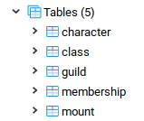
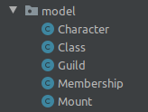
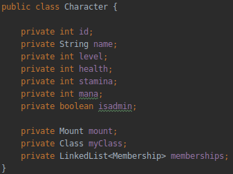
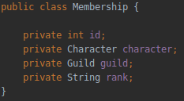

# Teaching-HEIGVD-AMT-2019-Project-One

### Part 2. How it has been implemented

Building a multi-tiered application, we used the MVC pattern to generate our HTML on the server. Following the recommended time line, we made a first iteration by implementing a login servlet (Controller), a JSP login page (View) and DAOs to access the database (Model).

#### The database

The project uses a single PostgreSQL database as a resource, hosted in a docker container. The database can be managed by a pgAdmin console, hosted in another container. The tables are the following.

#### The model

Each domain component is represented by a class in Java.

Relations between tables are implemented directly with the language variables. Here is an example with a character able to join multiple guilds using a LinkedList :

For this to work, the membership must contain both a character and a guild :

#### The controller

The web application is composed of servlets. Each servlet is linked to a specific URL pattern and will handle every requests made on it. For example, the login page can be reached using :

`http://localhost:8080/projectOne`**`/login`**

Servlets can process GET and POST requests. Several events can happen :

* 

#### The view 

The user can navigate the presentation tier through JSP (JavaServer Pages). Each page, except for the header and the footer, is linked to a servlet responsible for providing all the data needed to display the page correctly.

... uses **EJB** (Enterprise Java Beans) 

- Apply the **MVC pattern to generate markup (HTML)** on the server, and **not** to expose a REST API.
- Implement business services as **EJBs**.
- Store data in a **relational** database management system.
- Implement data access with **JDBC**.