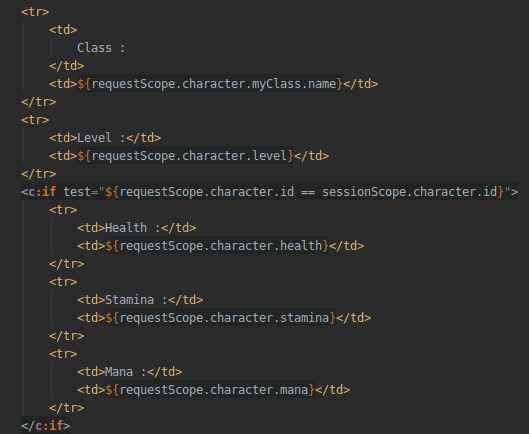

# Teaching-HEIGVD-AMT-2019-Project-One

### Part 2. How it has been implemented

Building a multi-tiered application, we used the MVC pattern to generate our HTML on the server. Following the recommended time line, we made a first iteration by implementing a login servlet (Controller), a JSP login page (View) and DAOs to access the database (Model).

#### The model

Each domain component is represented by a class in Java.

Relations between tables are implemented directly with the language variables. Here is an example with a character able to join multiple guilds using a LinkedList :

For this to work, the membership must contain both a character and a guild :

#### The controller

The web application is composed of servlets. Each servlet is linked to a specific URL pattern and will handle every requests made on it. For example, the login page can be reached using :

`http://localhost:8080/projectOne`**`/login`**

Servlets can process `GET` and `POST` requests. They also can manipulate session attributes and parameters. For example :

* On his first visit, a user opens the login page, submitting a `GET` request.
* The loginServlet's method `doGet` is triggered.
* The servlet delegates the display to `login.jsp`.
* The user then submits the login form with his credentials. A `POST` request is sent.
* The loginServlet's method `doPost` is triggered.
* The servlet uses an EJB component to log in the user using the database (more details below).
* If everything is correct, the servlet set a session attribute with the user's character and send it to the servlet responsible for the home page.
* If an error occurred, it is sent to `login.jsp` which will print it on the page.

Once they are done processing data - or not -, servlets always delegate the remaining work to JSP.

#### The view 

The user can navigate the presentation tier through JSP (JavaServer Pages). Each page, except for the header and the footer, is linked to a servlet responsible for providing all the data needed to display the page correctly.

These pages can receive session attributes and parameters from a servlet. Thanks to these data, JSP can display useful information such as characters names, classes descriptions or guilds memberships.

One useful feature is the possibility to access to request and session scopes. It allows to display limited information based on the rights of the current user. Below, we can see that a character's class is public, whereas the personal stats of the character are only visible to the character himself.

#### The services

Services are implemented using Stateless Session Beans. Except for `mount` which need no special management, there is an EJB for each domain component of our model : a `characterManager`, a `classManager`, a  `guildManager` and a `membershipManager`.

#### The database

The project uses a single PostgreSQL database as a resource, hosted in a docker container. The database can be managed by a pgAdmin console, hosted in another container. The tables are the following.

... uses **EJB** (Enterprise Java Beans) 

- Apply the **MVC pattern to generate markup (HTML)** on the server, and **not** to expose a REST API.
- Implement business services as **EJBs**.
- Store data in a **relational** database management system.
- Implement data access with **JDBC**.