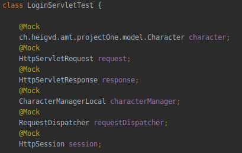
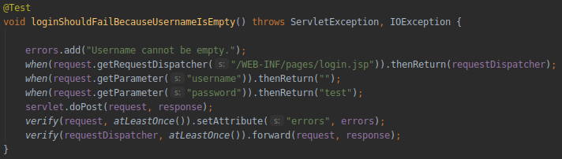
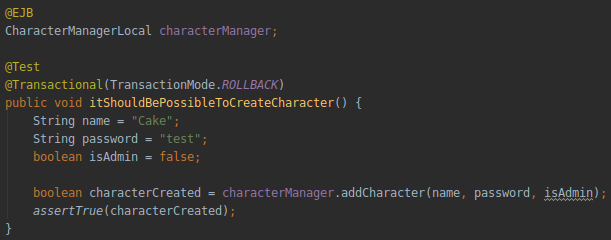
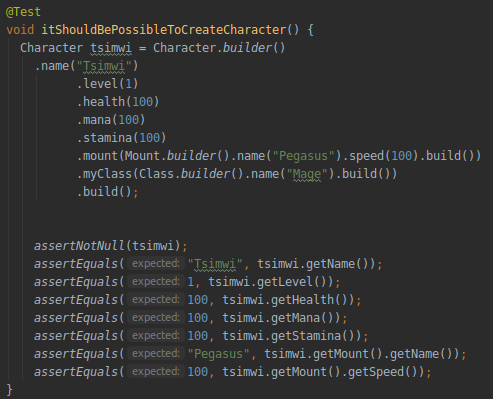

# Teaching-HEIGVD-AMT-2019-Project-One

### Part 3. Testing strategy

We had to set up several ways to test our components, such as DAO, models and servlets. To do so, we used tools like Mockito, Arquillian and JUnit.

#### 3.1 Mockito tests

Mockito is used to test servlets. The main part of servlet testing is to be sure that we reach the point that we wanted with the behaviors we defined. For this, we need to mock all needed objects, for example `request` or `RequestDispatcher`.

In this project, we tested almost all servlet with all cases. For example, the login page must send a specific error in case the user name is missing.

We can see that the return value of each object is defined. When `request.getParameter("username")` is called, we want the return value to be empty. Then, we verify that `request.setAttribut("error", errors)` has been called at least one time.

#### 3.2 Arquillian tests

Arquillian is used to test objects managed by the application server. It will package our tests, send them to the server and execute them. 

First, the application server and the database containers must be up and ready. Then, Payara's self-signed certificate has to be added to the JDK keystore in order to make Arquillian upload the tests (this has to be done once).

Here is a simple test where a character should be created on the database.  Arquillian uses the EJB as we do it in the main part of the application. Note that the `TransactionMode` is set to `ROLLBACK`, meaning that the state of the database is reverted after the test. Another option would be to`COMMIT` the changes.

#### 3.3 JUnit tests

We used JUnit to make tests on the model tier. 

These are simple unit tests, checking if objects and method calls fulfill our assertions.

