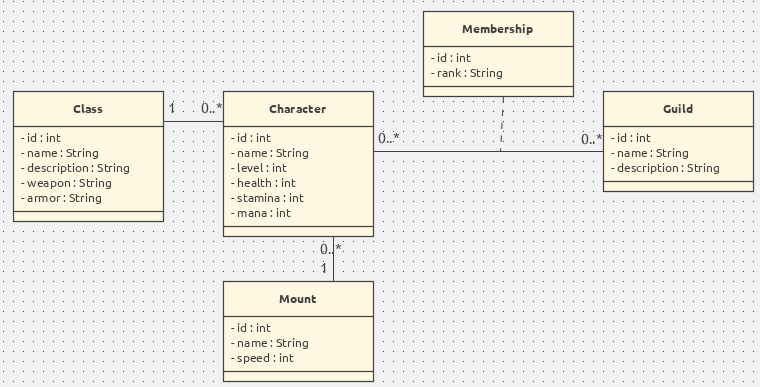
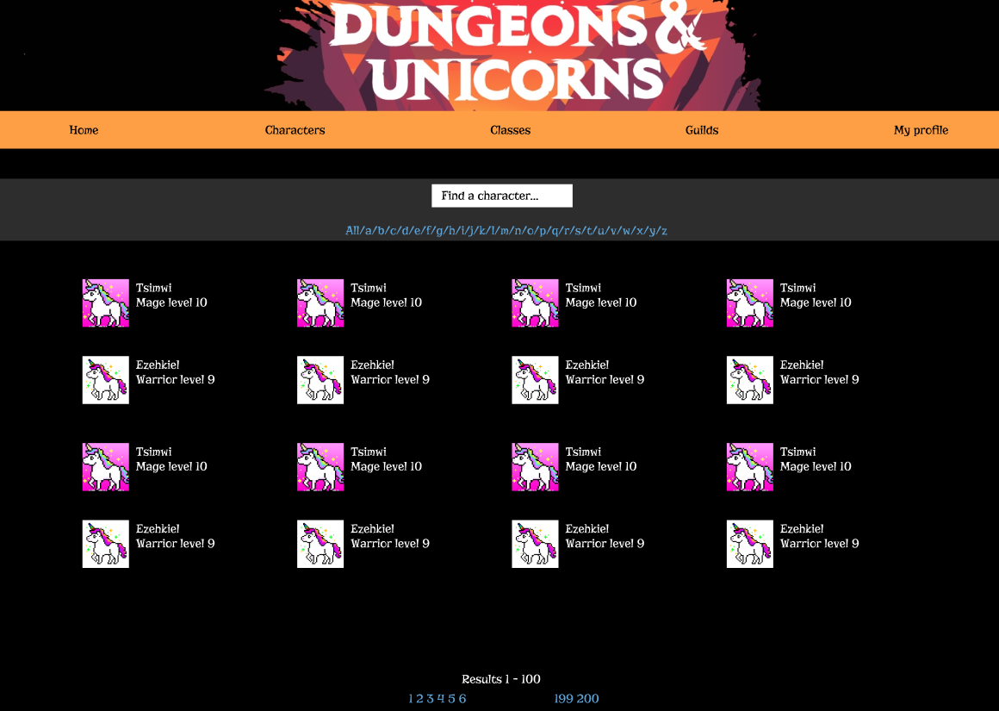
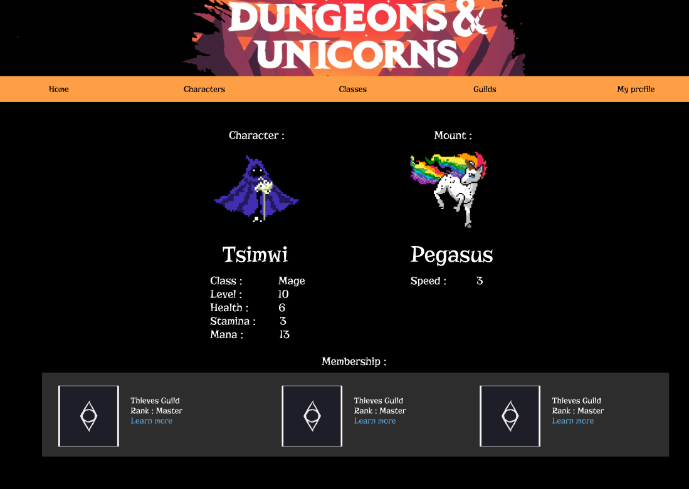
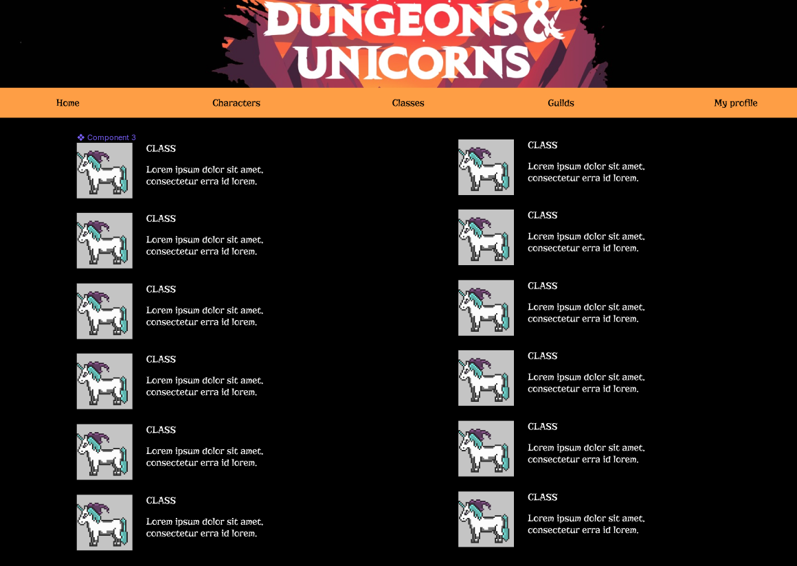
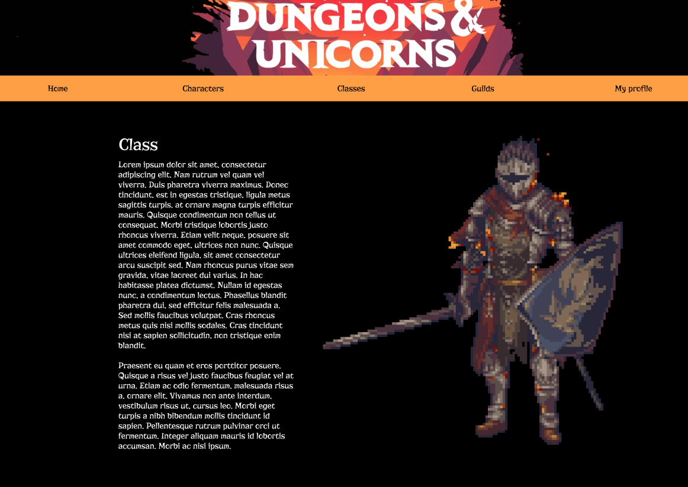

# Teaching-HEIGVD-AMT-2019-Project-One

### Part 1. What has been implemented

#### 1.1 Business domain

We decided to select an old role play game style business domain for our project, but a bit more fancy.  

**Dungeons & Unicorns** is about medieval characters going on an adventure. 

* Each character has a name, a level, statistics (health, stamina and mana) and a class (warrior, wizard, rogue, etc.).
* Each class has a name, a description and specifics weapon and armor.
* Characters can join one or more guilds to play with other characters. The membership between a character and a guild is characterized by a rank. A guild consists of a name and a description.
* Most importantly, every character is accompanied by a faithful unicorn mount. Mounts have a name and a speed.

#### 1.2 Mockups

To help us visualize the domain, we made mockups of what we through our pages would look like. Here are some of them.

The **characters** page :

The **profile** page :

The **classes** page :

A **class information** page :

These helped us to focus on the future implementation instead of how to design our pages.